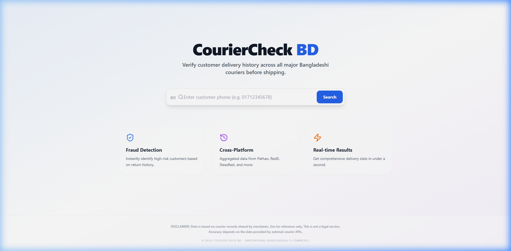
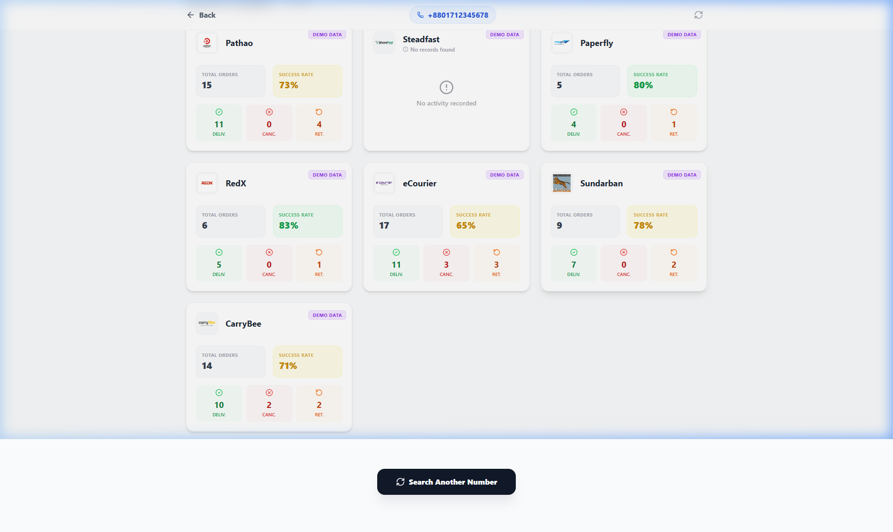

# CourierCheck BD 🇧🇩

A complete fraud detection web application for Bangladeshi e-commerce sellers. This application allows merchants to look up customer delivery history across multiple courier services by searching with a Bangladeshi phone number.

### 🌐 [Live Demo](https://courier-check-bd.vercel.app/)


*Home Page - Minimalist and easy to use*


*Results Page - Comprehensive courier insights and fraud scoring*

## Features
- **Unified Search:** Check customer history across Pathao, Steadfast, Paperfly, RedX, eCourier, and Sundarban.
- **Fraud Scoring:** Intelligent algorithm calculates a risk score (0-100) based on return rates and cancellation history.
- **Real-time Analytics:** View total orders, delivery success rate, and specific counts for delivered/cancelled/returned parcels.
- **Premium UI:** Modern, responsive design with animated score meters and status badges.
- **Security First:** Rate limiting, input sanitization, and server-side API calls.

## Tech Stack
- **Frontend:** React 18, TypeScript, Vite, Tailwind CSS, TanStack Query, Axios, Zod.
- **Backend:** Node.js, Express, TypeScript, Helmet, Winston, Morgan, Express Validator.

## Project Structure
```
fraud-check-bd/
├── client/                 # Frontend React application
│   ├── src/
│   │   ├── components/     # Reusable UI components
│   │   ├── hooks/          # Custom React hooks (usePhoneSearch)
│   │   ├── pages/          # Home and Result pages
│   │   ├── services/       # API client logic
│   │   └── types/          # TypeScript interfaces
├── server/                 # Backend Node.js application
│   ├── src/
│   │   ├── controllers/    # Route handlers
│   │   ├── middleware/     # Auth, Validation, Error Handling
│   │   ├── routes/         # API route definitions
│   │   ├── services/       # Courier API integrations & Mock service
│   │   └── utils/          # Phone validation & Fraud scoring logic
└── .env.example            # Environment variables template
```

## Getting Started

### Prerequisites
- Node.js (v16+)
- npm

### Installation

1. Clone the repository
2. Install Backend dependencies:
   ```bash
   cd server
   npm install
   ```
3. Install Frontend dependencies:
   ```bash
   cd ../client
   npm install
   ```

### Running the App

1. **Setup Environment:**
   Create a `.env` file in the `server` directory based on `.env.example`.
   ```bash
   USE_MOCK_API=true
   ```

2. **Start Backend:**
   ```bash
   cd server
   npm run dev
   ```

3. **Start Frontend:**
   ```bash
   cd client
   npm run dev
   ```

4. Open [http://localhost:5173](http://localhost:5173) in your browser.

## Adding Real API Keys
To use live data, set `USE_MOCK_API=false` in your `.env` file and provide the respective API keys for each courier. The service files in `server/src/services/` contain placeholders where you can integrate the real API responses.

## Disclaimer
Data is based on courier records. Use for reference only. Not a legal service.
